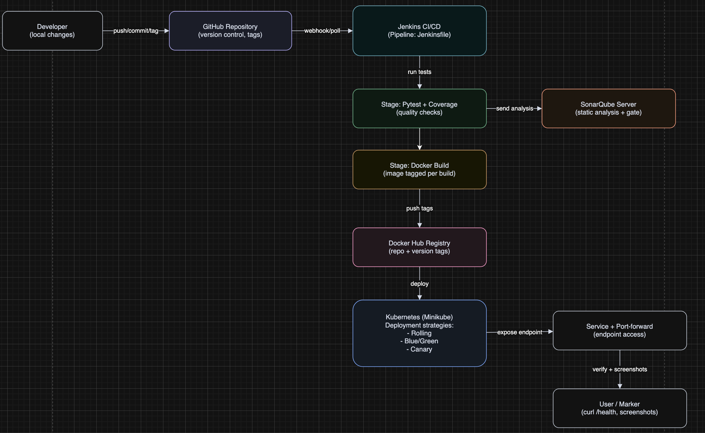

# ACEest Fitness & Gym — CI/CD SOP (for beginners / non-technical)

This is a **step-by-step checklist** for Assignment 2.

You do not need to understand every technology to complete it. You only need to run commands in the right order and know **what “good” looks like**.

## What you will prove (in plain language)

- **The code works** (unit tests)
- **The app runs in a container** (Docker image)
- **The app runs in Kubernetes** (Minikube = local cloud)
- **You can deploy and rollback in different ways** (Rolling / Blue-Green / Canary in this project)
- **The code is analyzed for quality** (SonarQube)
- **Automation exists** (Jenkins pipeline)
- **Images are versioned in Docker Hub** (tags like `1.0`, `1.1`)

## CI/CD Architecture Overview (paste into report)

This project follows a standard DevOps delivery flow: code changes are committed and versioned in GitHub, which triggers a Jenkins Pipeline (`Jenkinsfile`). Jenkins runs automated unit tests (Pytest) and publishes code-quality analysis to SonarQube, then builds a Docker image and tags it per build/version. The image is pushed to Docker Hub as a versioned artifact, and the release is deployed to Kubernetes (Minikube in this assignment). Kubernetes runs the app behind a Service and supports progressive delivery patterns (Rolling, Blue/Green, Canary) so updates can be verified and rolled back safely. A clean architecture diagram is provided in `ci-cd-architecture.drawio` for inclusion in the report.



## 0) Project map (what the files are)

- **App code**: `aceest_fitness_web/`
- **App entry (HTTP server)**: `wsgi.py`
- **Tests**: `tests/`
- **Dependencies**: `requirements.txt`
- **Build container**: `Dockerfile`
- **Jenkins pipeline**: `Jenkinsfile`
- **SonarQube settings**: `sonar-project.properties`
- **Kubernetes configs**: `k8s/`

## 1) Glossary (read once)

- **Minikube**: a *small local Kubernetes* on your laptop. Think “mini production”.
- **kubectl**: the command to control Kubernetes.
- **Pod**: one running copy of the app in Kubernetes.
- **Service**: how the app is reachable *inside* the cluster.
- **port-forward**: a simple way to open the app on your browser from your laptop.
- **Docker / image**: a packaged app that should run the same on any machine.
- **Docker Hub**: a website to store and version your images.
- **Jenkins**: a tool that runs your pipeline and shows a green “SUCCESS” log.
- **SonarQube**: a website with code quality results + a quality gate.

**Safety rule for screenshots:** never show passwords/tokens. If something sensitive appears, blur it.

## 2) “Evidence” folder (do this first)

Create a folder to store proof screenshots and logs.

```bash
mkdir -p evidence
```

Name files like:
- `00-pytest-pass.txt` (or screenshot)
- `10-minikube-nodes.txt`
- `20-k8s-pods-running.png`
- `30-jenkins-success.png`
- `40-sonar-quality-gate.png`
- `50-dockerhub-tags.png`
- `60-bg-switch-before.png` / `61-bg-switch-after.png`
- `70-canary-replicas.png`

## 3) A) Pytest: prove the app works (fastest check)

| Step / command | “Good” looks like | “Bad” looks like | What to do next (simple) |
| --- | --- | --- | --- |
| `python3 -m venv .venv` | a `.venv` folder is created | errors about python missing | install Python 3, retry |
| `source .venv/bin/activate` (Windows: `.\.venv\Scripts\activate`) | your prompt may show `(.venv)` | “command not found” | use the correct command for your OS/shell |
| `pip install -r requirements.txt` | ends with install success (may take a minute) | network errors / SSL errors | retry with internet, try again after VPN off/on |
| `pytest -q` | ends with `passed` and a test count | shows failures | read the first failure block (it names the file + line) |

**Screenshot to save:** the terminal after `pytest -q` showing all tests **passed** (or save full output as a `.txt` file in `evidence/`).

## 4) B) Minikube: deploy the app (local “production”)

> Run these from the same folder that contains the `k8s/` directory.

### 4.1 Start a clean local cluster (recommended for demos)

| Command | Good | Bad | Next step |
| --- | --- | --- | --- |
| `minikube delete` | ends OK (or “not found” is OK) | errors about permissions | read the error, restart Docker Desktop, retry |
| `minikube start` | shows cluster started / context ready | stuck forever | `minikube status` and read the last lines |
| `kubectl get nodes` | node shows `Ready` | `NotReady` or errors | `minikube status` → restart if needed |
| `kubectl cluster-info` | API server address prints | connection errors | your cluster is not up → `minikube start` again |

**Screenshot to save:** `kubectl get nodes` with `Ready` (or save the terminal output in `evidence/10-minikube-nodes.txt`).

### 4.2 Build the image *inside* Minikube Docker (avoids `ImagePullBackOff`)

| Command | Good | Bad | Next step |
| --- | --- | --- | --- |
| `eval "$(minikube -p minikube docker-env)"` | no error in terminal | `minikube: command not found` | start Minikube / install Minikube |
| `docker build -t aceest-fitness:1.0 .` | ends with `FINISHED` / `naming` line | long download errors / TLS errors | internet issue; fix network and retry |
| `docker images \| grep aceest-fitness` | a line with tag `1.0` | no output | the build didn’t run or wrong tag; rebuild |

**Screenshot to save:** the `docker images` line showing `aceest-fitness` and tag `1.0`.

### 4.3 Create namespace + apply Deployment + set image

| Command | Good | Bad | Next step |
| --- | --- | --- | --- |
| `kubectl apply -f k8s/namespace.yaml` | `created` or `unchanged` | “not found” file path | run from project root, ensure `k8s/namespace.yaml` exists |
| `kubectl apply -f k8s/rolling-deployment.yaml -f k8s/service.yaml` | `created/unchanged` for objects | apply errors (YAML) | re-download repo / check you didn’t edit YAML incorrectly |
| `kubectl -n aceest set image deployment/aceest-web web=aceest-fitness:1.0` | `image updated` | not found / wrong name | re-apply the rolling deployment file |
| `kubectl -n aceest rollout status deployment/aceest-web` | `successfully rolled out` | hangs a long time | go to 4.4 (pods) |
| `kubectl -n aceest get pods` | `Running` and `1/1` in READY (after it settles) | `ImagePullBackOff` / `0/1` for long time | re-run 4.2 and `set image` again |

**Screenshot to save:** `get pods` showing `Running` + `1/1`.

**Most common “bad” and fix:**

```bash
kubectl -n aceest get pods
```

If you see `ImagePullBackOff`:

```bash
eval "$(minikube -p minikube docker-env)"
docker build -t aceest-fitness:1.0 .
kubectl -n aceest set image deployment/aceest-web web=aceest-fitness:1.0
kubectl -n aceest rollout status deployment/aceest-web
```

### 4.4 Open the app: port-forward (the easiest for beginners)

Keep **Terminal A** open while testing.

| Command | Good | Bad | Next step |
| --- | --- | --- | --- |
| `kubectl -n aceest port-forward svc/aceest-web 8080:80` | `Forwarding from 127.0.0.1:8080` | `address already in use` | change to `8081:80` instead of `8080:80` |
| `curl http://127.0.0.1:8080/health` | JSON with `"status":"ok"` | empty/timeout | Terminal A not running; or wrong port number |
| `curl http://127.0.0.1:8080/clients` | JSON (often empty list) | error JSON | if it’s 500, check logs (below) |

**If health fails, get logs (simple diagnostic):**

```bash
kubectl -n aceest logs deploy/aceest-web --tail=200
```

**Screenshot to save:** `curl` output of `/health` (this is a strong “it works in Kubernetes” proof).

> Note: opening the base URL in a browser for `/` may not show a page (that’s normal). The assignment’s health check path is `/health`.

## 5) C) Blue / Green: prove switch + rollback

Blue/Green in this project means:
- you run two Deployments: **blue** and **green**
- a Service chooses which one receives traffic by a label

Run:

```bash
kubectl apply -f k8s/bluegreen.yaml
kubectl -n aceest set image deployment/aceest-web-blue web=aceest-fitness:1.0
kubectl -n aceest set image deployment/aceest-web-green web=aceest-fitness:1.0
```

Start on BLUE, turn GREEN off, point the Service to BLUE:

```bash
kubectl -n aceest scale deploy/aceest-web-blue --replicas=2
kubectl -n aceest scale deploy/aceest-web-green --replicas=0
kubectl -n aceest patch svc aceest-web-bg -p '{"spec":{"selector":{"app":"aceest-web","track":"blue"}}}'
```

Switch traffic to GREEN:

```bash
kubectl -n aceest scale deploy/aceest-web-green --replicas=2
kubectl -n aceest patch svc aceest-web-bg -p '{"spec":{"selector":{"app":"aceest-web","track":"green"}}}'
```

Rollback to BLUE (instant “undo” of the traffic switch):

```bash
kubectl -n aceest patch svc aceest-web-bg -p '{"spec":{"selector":{"app":"aceest-web","track":"blue"}}}'
```

**What to look for in command output (good signs):**
- `scale` prints “scaled”
- `patch` prints the service (or `patched`)
- `kubectl -n aceest get pods` shows the expected blue/green running counts at each step

**Screenshots to save (strong assignment proof):**
- `kubectl -n aceest get deploy,pods` in three states: blue active, green active, back to blue
- a short note in your report like “Service selector flips between `track: blue` and `track: green`” (you can also screenshot `describe svc` if you want, optional)

> Optional: if you need to access this service, use a second `port-forward` to `aceest-web-bg` on a different local port. For assignment proof, `get pods` + the patch commands is usually enough.

## 6) D) Canary: increase weight + rollback (replica-based)

| Command | What “success” means |
| --- | --- |
| `kubectl apply -f k8s/canary.yaml` + `set image ...` | you see canary+stable objects exist |
| `kubectl -n aceest get deploy` | you can see `REPLICAS` counts for canary and stable |
| `kubectl -n aceest scale deploy/aceest-web-canary --replicas=2` | canary replica count goes up (more canary than before) |
| `kubectl -n aceest scale deploy/aceest-web-canary --replicas=0` | canary is removed (rollback pattern) |

**Screenshot to save:** `get deploy` before scaling canary, after increasing canary, and after canary=0.

## 7) E) SonarQube: one scan + the screenshots the marker expects

### 7.1 Start SonarQube

```bash
docker run -d --name sonarqube -p 9000:9000 sonarqube:lts-community
```

- Open: `http://127.0.0.1:9000`
- The first time can take 1–3 minutes to become ready.
- Default login (first time):
  - Username: `admin`
  - Password: `admin`
  - You will be asked to change the password after the first login.

| Good | Bad |
| --- | --- |
| the website eventually loads a login / setup | page never loads | check Docker is running, wait, retry in 2 minutes |

**Screenshot to save (SonarQube is up):** the home/login page (no secrets).

### 7.2 In the website UI
- create a project
- generate a user token (do not screenshot the token; store it privately)

Where to generate the token:
- SonarQube → (top-right profile) **My Account** → **Security** → **Generate Tokens**

If the UI is not working, you can create (and revoke) tokens from the CLI using the SonarQube API:

Create token (prompts for the `admin` password):

```bash
curl -u admin -X POST "http://127.0.0.1:9000/api/user_tokens/generate" \
  -d "name=aceest-local"
```

Revoke/remove an existing token by name:

```bash
curl -u admin -X POST "http://127.0.0.1:9000/api/user_tokens/revoke" \
  -d "name=aceest-local"
```

### 7.3 Run tests with coverage, then run `sonar-scanner`

#### Install Sonar Scanner CLI (sonar-scanner)

Option A (recommended on macOS with Homebrew):

```bash
brew install sonar-scanner
sonar-scanner --version
```

Option B (no local install): run scanner using Docker

```bash
docker run --rm \
  -e SONAR_HOST_URL="http://host.docker.internal:9000" \
  -e SONAR_TOKEN="SONAR_TOKEN" \
  -v "$PWD:/usr/src" \
  sonarsource/sonar-scanner-cli
```

Replace `SONAR_TOKEN` with your real token value.

```bash
python3 -m venv .venv
. .venv/bin/activate
pip install -r requirements.txt
pytest -q --cov=aceest_fitness_web --cov-report=xml:coverage.xml

sonar-scanner -Dsonar.host.url=http://127.0.0.1:9000 -Dsonar.login=PASTE_REAL_TOKEN_HERE
```

| Good | Bad |
| --- | --- |
| `sonar-scanner` ends without ERROR | authentication failed | wrong token/URL; fix and rerun |

**Screenshots to save (assignment):**
- SonarQube project “Overview / Dashboard” after analysis
- Quality gate status (Passed/Failed is OK—failed can still be a learning point if you explain it)

**Stop SonarQube (optional, frees memory):**

```bash
docker rm -f sonarqube
```

## 8) F) Docker Hub: “repo with versions” (tags you can show)

You must be able to show at least two tags, for example `1.0` and `1.1`.

| Command | What “good” means |
| --- | --- |
| `docker login` | login success message |
| `docker build -t <user>/aceest-fitness:1.0 .` + `docker push ...:1.0` | “Pushed” or digest line at the end |
| `docker build -t <user>/aceest-fitness:1.1 .` + `docker push ...:1.1` | same as above |
| (optional) `latest` tag | you can also push `latest`, but the assignment is mostly about *versions* |

**Screenshot to save:** your Docker Hub repository “Tags” page showing `1.0` and `1.1`.

## 9) G) Jenkins: open the portal, prove automation, and screenshot the right things

### 9.0 One required edit (so Jenkins pushes to YOUR Docker Hub)

Before running Jenkins, update the image name in `Jenkinsfile`:

- Find `IMAGE_NAME = "your-dockerhub-username/aceest-fitness"`
- Replace it with your real Docker Hub repo, for example:
  - `IMAGE_NAME = "DOCKERHUB_USERNAME/aceest-fitness"`

You do **not** need to change the build command itself:

```bash
docker build -t ${IMAGE_NAME}:${IMAGE_TAG} -t ${IMAGE_NAME}:latest .
```

If you want Jenkins to deploy to Kubernetes using Docker Hub images, also replace the placeholder image names inside:
- `k8s/rolling-deployment.yaml`
- `k8s/bluegreen.yaml`
- `k8s/canary.yaml`

If you deploy to Minikube using local images (the Minikube `docker-env` method), you can leave the Kubernetes YAML placeholders as-is and use `kubectl set image ...` during your demo.

### 9.1 Start Jenkins

```bash
docker run -d --name jenkins -p 8081:8080 -p 50000:50000 jenkins/jenkins:lts
```

Get the one-time admin password (do not screenshot the password in clear text; blur it):

```bash
docker exec jenkins cat /var/jenkins_home/secrets/initialAdminPassword
```

Open Jenkins: `http://127.0.0.1:8081`

| Good | Bad |
| --- | --- |
| a Jenkins setup / login page loads | can’t connect | check Docker, port, URL |

### 9.2 In Jenkins UI (minimum clicks path)

1) Install suggested plugins, then:
2) **Manage Jenkins → Plugins** and ensure these are installed/available:
   - Pipeline
   - Git
   - Docker Pipeline
   - Credentials Binding
   - SonarQube Scanner

3) **Manage Jenkins → Credentials** → add a Docker Hub credential
   - **Kind**: username/password
   - **ID**: `dockerhub`  (this matches the `Jenkinsfile`)

4) (Optional) **Manage Jenkins → System → SonarQube servers**
   - name must be **`SonarQube`** to match the `Jenkinsfile`

5) New Item → **Pipeline**
- Definition: *Pipeline script from SCM*
- Git repo: your public GitHub repo
- **Script path**:
  - if your repository root is this project folder, use: `Jenkinsfile`
  - if your repository root is a parent folder, use: `DevopsAssignmen2-sound/Jenkinsfile` (use whichever is true in your case)

6) **Build Now** → open the build → open **Console Output**

| Good | Bad |
| --- | --- |
| the log ends with `Finished: SUCCESS` (or your Jenkins may say build succeeded) | the log ends with ERROR/FAILED on a stage | read the first red error block |

**Screenshots to save (assignment):**
- Jenkins job page with a successful build in the left “Build History”
- Console Output: top (shows it started) + bottom (shows SUCCESS)

**Reality check (so you are not surprised):** Jenkins in Docker is great for screenshots, but the pipeline’s Kubernetes deploy step may not work *automatically* unless your Jenkins can access your `kubectl` context. That is common in coursework. A normal approach is:
- prove app deployment in Minikube manually
- prove automation in Jenkins for tests/scan/docker push

**Stop Jenkins (optional):**

```bash
docker rm -f jenkins
```

## 10) The “5-minute if stuck” table

| Symptom | Most likely cause | What to do |
| --- | --- | --- |
| `kubectl` not found | kubectl not installed or PATH issue | install kubectl, reopen terminal |
| can’t connect to server | minikube not running | `minikube start` |
| `ImagePullBackOff` | image not built in Minikube | repeat Minikube `docker-env` + build + set image |
| `0/1` pods | crash/health failing | `kubectl -n aceest logs deploy/aceest-web` |
| browser blank on `/` | no route at `/` | use `/health` (expected for this app) |
| `curl` hangs in `$(minikube service ... --url)` patterns | that pattern can be flaky | prefer `port-forward` in section 4.4 |

## 11) Final submission bundle checklist (what to hand in)

- A zip containing your code, tests, Dockerfile, k8s YAML, Jenkinsfile, and this README
- A short report (2–3 pages) with:
  - your architecture in words (GitHub → CI → image registry → K8s)
  - 2–3 real challenges and how you fixed them
  - screenshots from `evidence/`

## 12) Instructor view (1 page): requirement → what proves it

Use this table as a **final marking checklist** before you submit.  
“Minimum pass signal” means: *if a marker only sees this one thing, it still strongly supports the requirement*.

| Assignment story (plain English) | What you submit as proof (pick 1–2) | Where it usually comes from in this repo | Minimum pass signal (what a marker can verify quickly) |
| --- | --- | --- | --- |
| The product is a Flask app with a sensible structure | Screenshot of GitHub file tree; link to public repo; optional short demo of `/health` in browser | `aceest_fitness_web/`, `wsgi.py` on GitHub | A working `/health` response from the deployed app |
| Version control + clean engineering workflow | Screenshot: GitHub commits/PRs/tags; paste repo URL in report | GitHub | Repo is accessible + you can show tags/commits that match versions |
| Automated unit tests (Pytest) are real | Screenshot/terminal log: all tests pass | `tests/`, `pytest` output in `evidence/00-*.txt` | Output shows all tests `passed` |
| CI is Jenkins with an automated pipeline | Screenshot: Jenkins build green + 2nd screenshot: bottom of console shows SUCCESS | `Jenkinsfile`, Jenkins “Build Now” | Console log ends in success (and shows stages) |
| Containerization works | Screenshot/terminal: `docker build` success + `docker images` line | `Dockerfile` | You can name an image+tag and show it exists |
| A registry with multiple app versions (Docker Hub) | Screenshot: Docker Hub “Tags” page showing at least 2 different tags (ex: `1.0` + `1.1`) + optional push log snippet | `docker push` + Docker Hub | Tags exist publicly (or you add marker access) |
| Static quality analysis (SonarQube) | Screenshot: SonarQube dashboard + quality gate (pass or fail) | `sonar-project.properties`, `sonar-scanner` | SonarQube project shows an analysis with a quality gate result |
| Deploy to Kubernetes and expose an endpoint | Screenshot: `kubectl get pods,svc` + `curl` output; optional browser screenshot | `k8s/`, `kubectl` | Pods `Running` + `curl /health` returns JSON |
| Rolling update strategy is demonstrated | Screenshot: `kubectl describe deploy aceest-web` (strategy section) OR the YAML file snippet + pods healthy during rollout | `k8s/rolling-deployment.yaml` + rollout | Deployment shows `RollingUpdate` and pods go healthy |
| Blue–Green: switch and rollback is demonstrated | 3 small screenshots/terminal pastes: (1) blue live (2) green live (3) back to blue | `k8s/bluegreen.yaml` + `kubectl patch svc` | Service selector changes and pods match the “live” color |
| Canary: progressive rollout + rollback is demonstrated | Screenshot/terminal: `kubectl get deploy` before/after scale + rollback | `k8s/canary.yaml` + `kubectl scale` | Replicas show canary increasing then canary=0 (rollback) |
| Shadow + A/B testing (if your brief requires *all* strategies) | A short “approach + diagram” in your 2–3 page report, plus a realistic plan (headers/flags/service mesh) | (Not implemented as full mesh routing in this repo) | This must be a clearly labeled “additional strategy” section, not a fake K8s manifest screenshot |

**Notes a marker will care about (avoid losing marks for “plausible but wrong” proof):**
- A screenshot of a browser on `/` is *not* proof; use `/health` and/or the API calls.
- Don’t post secrets. Blur tokens/passwords in all screenshots.
- If Jenkins can’t run `kubectl` on your machine, you can still pass by proving **K8s in Minikube** and proving **Jenkins automation** separately (this README calls that out).