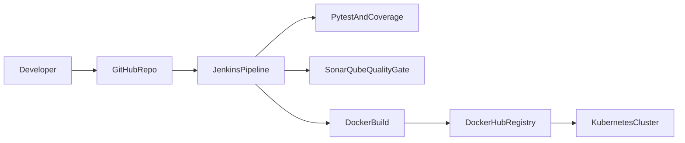

## ACEest Fitness & Gym — CI/CD Implementation (Assignment 2)

### 1) CI/CD architecture overview

- **Source control**: Git + GitHub repository with version tags for each incremental release.
- **CI server**: Jenkins pipeline (see `Jenkinsfile`).
- **Quality gates**:
  - **Unit tests**: Pytest + coverage (`coverage.xml`)
  - **Static analysis**: SonarQube via `sonar-scanner` + `sonar-project.properties`
- **Build & packaging**: Docker image built from `Dockerfile` and tagged per build number.
- **Registry**: Docker Hub (`your-dockerhub-username/aceest-fitness:<tag>`)
- **CD**: Kubernetes apply manifests from `k8s/` (rolling baseline + strategy demos)

Mermaid diagram you can paste into the report:

### 2) What was implemented (mapped to brief)

- **Flask application**: `aceest_fitness_web/` with endpoints:
  - `GET /health` (includes version)
  - `POST /clients`, `GET /clients`
  - `POST /clients/<id>/workouts`, `GET /clients/<id>/workouts`
- **Testing**: `tests/` uses Pytest to validate API behavior + error paths.
- **Containerization**: `Dockerfile` runs production server using Gunicorn on port 8000.
- **Jenkins CI/CD**:
  - creates venv, installs deps, runs tests + coverage
  - runs SonarQube scan (if Jenkins has scanner + server configured)
  - builds image, smoke-tests container via `/health`
  - pushes to Docker Hub (credential id `dockerhub`)
  - deploys to Kubernetes (rolling)
- **Kubernetes deployments**:
  - Rolling update: `k8s/rolling-deployment.yaml` + `k8s/service.yaml`
  - Blue/Green: `k8s/bluegreen.yaml` (manual service switch)
  - Canary: `k8s/canary.yaml` (weight via replica ratio)

### 3) Deployment strategies + rollback

- **Rolling update**: Kubernetes strategy config in `k8s/rolling-deployment.yaml`
- **Blue/Green rollback**: switch service selector back to `track: blue`
- **Canary rollback**: scale canary to 0 replicas

### 4) Challenges faced + mitigation

- **Challenge**: tests with SQLite `:memory:` reset DB between requests.
  - **Fix**: keep an app-scoped in-memory DB connection alive for tests.
- **Challenge**: packaging/CI consistency across machines.
  - **Fix**: containerize runtime and define dependencies in `requirements.txt`.

### 5) Evidence / screenshots to include

- Jenkins pipeline run (green stages)
- SonarQube project page (quality gate)
- Docker Hub repository tags
- Kubernetes `kubectl get pods,svc -n aceest` showing running workloads
- `curl` to your exposed endpoint `/health` showing version

